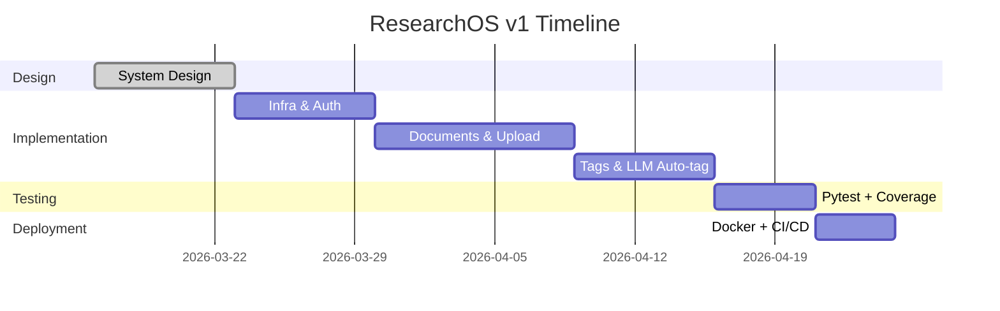
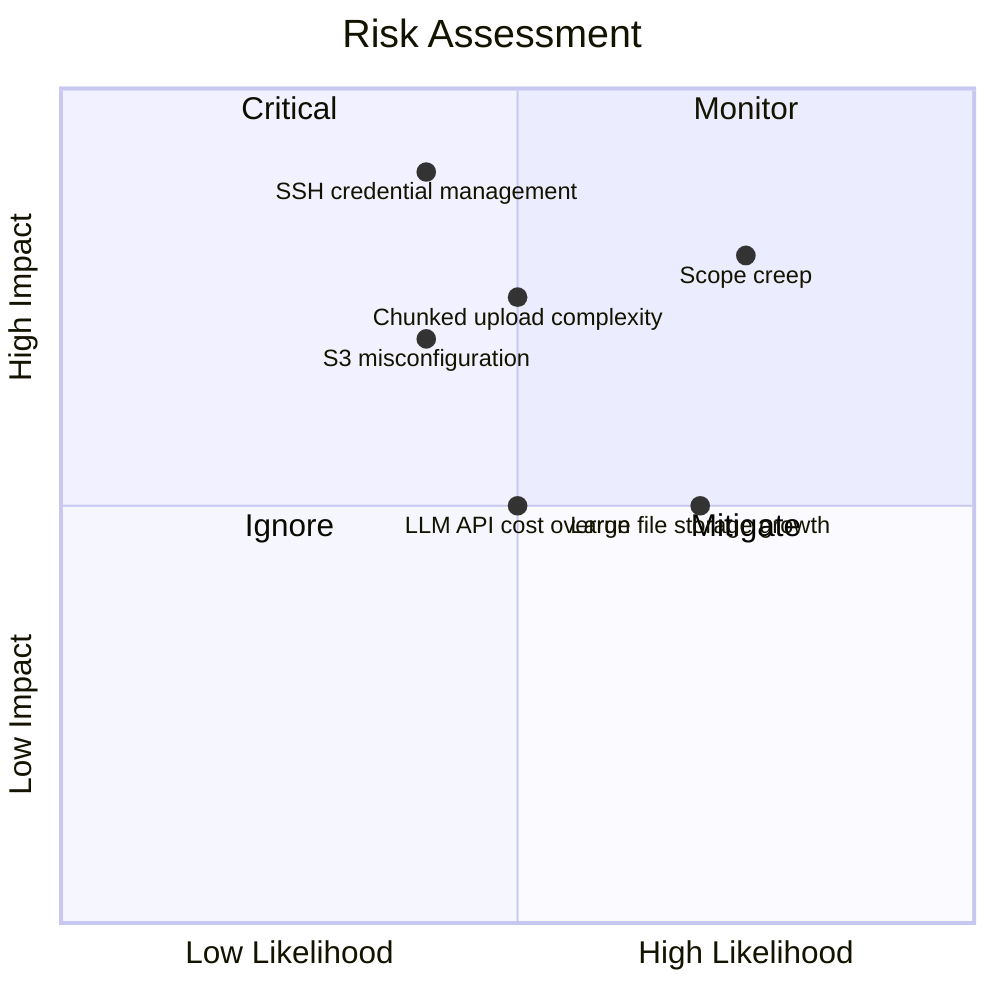

# 1. Planning

- Origin: First phase of SDLC, happens before any design or code
- Purpose: Align everyone on what we're building, why, and whether it's worth doing
- Without it: Teams start building without agreement on scope, leading to wasted effort, missed deadlines, and scope creep

---

## Scope

- Origin: Comes from initial problem discovery — what pain does this solve?
- Purpose: Draw a clear boundary of what v1 includes and excludes
- Without it: Every new idea gets added, the project never ships

What's in v1:
- Self-hosted platform for managing research documents (PDF, LaTeX, datasets, model weights)
- File transfer relay: old_server (SSH) → our_app → target_server (SSH or S3/bucket)
- Chunked upload for large file transfers
- Document management: store, categorize, tag, search
- LLM-based auto-tagging from PDF content
- API-only

Out of scope for v1:
- Frontend UI
- Multi-user collaboration
- Real-time notifications

---

## Timeline

- Origin: Derived from scope size and available resources
- Purpose: Set realistic expectations and create checkpoints to detect if the project is falling behind
- Without it: Work expands indefinitely with no pressure to ship

---

## Resources

- Origin: Inventory of what's available to execute the plan
- Purpose: Identify gaps early so blockers are known upfront
- Without it: You discover mid-project that you can't proceed due to missing access or budget

Available:
- 1 developer
- OpenAI or Gemini API key (for auto-tagging)
- A server or local machine with Docker

---

## Risk Assessment

- Origin: Comes from experience and asking "what could go wrong?"
- Purpose: Proactively identify threats and define mitigations before they become problems
- Without it: Risks become surprises, surprises kill projects

| Risk | Mitigation |
|------|------------|
| LLM API cost overrun | Cap tokens per request, use excerpt not full doc |
| Large file storage growth | Set max file size limit, monitor disk usage |
| Chunked upload complexity | Well-defined chunk protocol, add status endpoint |
| SSH credential management | Store credentials encrypted, never in plaintext |
| S3/bucket misconfiguration | Validate bucket access on connection setup |
| Scope creep | Strict OUT OF SCOPE list in spec |

---

## Decision

- Origin: The output of the entire planning phase
- Purpose: An explicit go/no-go statement so there's no ambiguity about whether the project is approved to proceed
- Without it: Work starts without formal alignment, making it easy to abandon or pivot without accountability

Proceed with v1 as defined in `specification.txt`.
