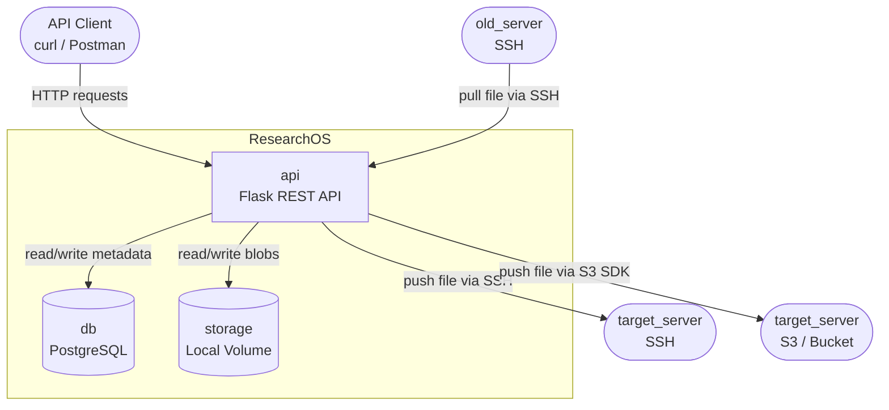
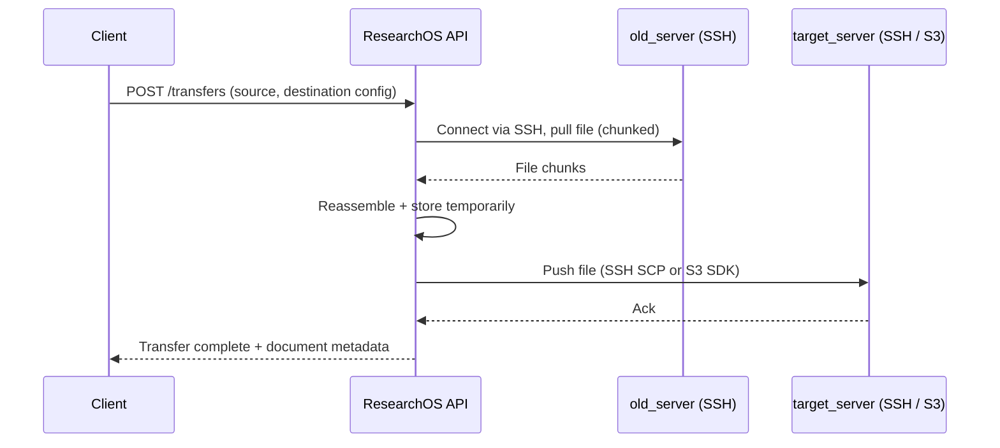

# 3a. Architecture

- Origin: Comes from requirements — how many moving parts does the system need?
- Purpose: Define the high-level structure of services and how they communicate
- Without it: Developers make local decisions that conflict with each other, creating integration nightmares

---

## System Overview

---

## File Transfer Flow

- Origin: Core feature requirement — old_server → our_app → target_server
- Purpose: Show how ResearchOS acts as a relay between source and destination
- Without it: The transfer feature has no clear ownership of each step

---

## Services

- Origin: Derived from tech stack decisions and deployment requirements
- Purpose: Define what each container does and its boundaries
- Without it: Responsibilities overlap and services become tightly coupled

| Service | Image | Responsibility |
|---------|-------|----------------|
| api | python:3.11 (custom) | Flask REST API, business logic, SSH/S3 transfer |
| db | postgres:15 | Persistent metadata storage |
| storage | local volume | File blob storage (temp chunks + final files) |
