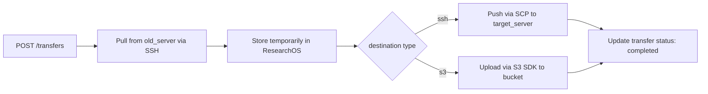

# 3c. API Contract

- Origin: Derived from functional requirements — each FR maps to one or more endpoints
- Purpose: Define the interface between client and server before implementation begins
- Without it: Frontend/client and backend make incompatible assumptions about request/response shapes

---

## Auth

| Method | Endpoint | Description |
|--------|----------|-------------|
| POST | `/auth/register` | Register new user |
| POST | `/auth/login` | Login, returns JWT token |

---

## Documents

| Method | Endpoint | Description |
|--------|----------|-------------|
| GET | `/documents` | List documents (filter: tag, category, file_type) |
| POST | `/documents` | Upload file + metadata |
| GET | `/documents/<id>` | Get document metadata |
| GET | `/documents/<id>/download` | Download file blob |
| DELETE | `/documents/<id>` | Delete document |
| GET | `/documents/<id>/status` | Get upload/transfer status |

---

## Chunked Upload

| Method | Endpoint | Description |
|--------|----------|-------------|
| POST | `/documents/<id>/chunks` | Upload a single chunk |

Request headers:
- `X-Chunk-Index`: chunk number (0-based)
- `X-Total-Chunks`: total number of chunks
- `Content-Type`: `application/octet-stream`

---

## Tags

| Method | Endpoint | Description |
|--------|----------|-------------|
| GET | `/tags` | List all tags |
| POST | `/documents/<id>/tags` | Add tags manually |

---

## LLM Auto-tag

| Method | Endpoint | Description |
|--------|----------|-------------|
| POST | `/documents/<id>/autotag` | Trigger LLM tag suggestion |
| PATCH | `/documents/<id>/tags/<tag_id>` | Accept or reject a suggested tag |

---

## File Transfer

| Method | Endpoint | Description |
|--------|----------|-------------|
| POST | `/transfers` | Create a transfer job (old_server → our_app → target_server) |
| GET | `/transfers/<id>` | Get transfer job status |

### POST /transfers — Request Body

```json
{
  "document_id": "uuid",
  "source": {
    "type": "ssh",
    "host": "old_server_host",
    "port": 22,
    "username": "user",
    "key_path": "/path/to/key",
    "file_path": "/remote/path/file.pdf"
  },
  "destination": {
    "type": "ssh | s3",
    "host": "target_host",
    "port": 22,
    "username": "user",
    "key_path": "/path/to/key",
    "file_path": "/remote/path/file.pdf",
    "bucket": "my-bucket",
    "prefix": "research/"
  }
}
```

---

## Transfer Flow Diagram


