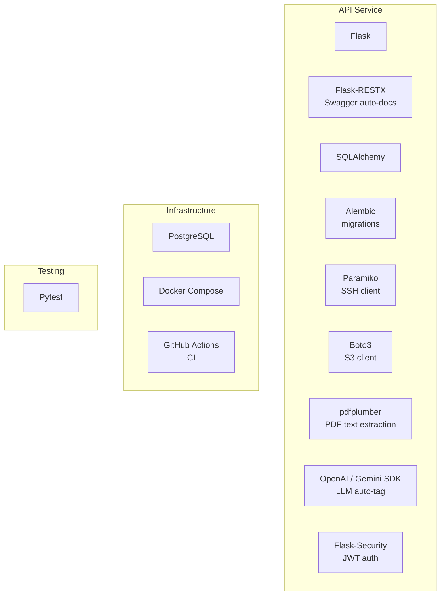

# 3d. Tech Stack

- Origin: Decisions made based on requirements, team familiarity, and ecosystem maturity
- Purpose: Document what technology is used and why, so future contributors understand the rationale
- Without it: Technology choices feel arbitrary and are hard to challenge or replace

---

## Stack Overview

---

## Decisions

| Layer | Choice | Reason |
|-------|--------|--------|
| Web framework | Flask + Flask-RESTX | Lightweight, auto Swagger docs, well-known in Python ecosystem |
| ORM | SQLAlchemy | Mature, flexible, works well with Alembic for migrations |
| Database | PostgreSQL | Reliable, supports UUID, JSONB, and array types |
| Auth | Flask-Security (JWT) | Integrates with Flask, handles token lifecycle |
| SSH transfer | Paramiko | Pure Python SSH library, no system dependency on openssh |
| S3 transfer | Boto3 | Standard AWS SDK, works with any S3-compatible storage |
| PDF extraction | pdfplumber | Simple API, good accuracy for research PDFs |
| LLM | OpenAI / Gemini (configurable) | Abstracted behind a service layer to allow swapping |
| Containerization | Docker Compose | Single command startup, matches spec requirement |
| CI | GitHub Actions | Free for public repos, integrates with GitHub natively |
| Testing | Pytest | Standard Python testing framework |
