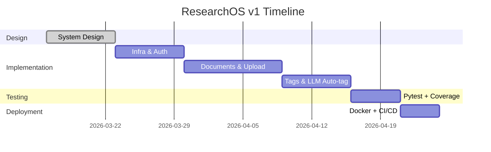
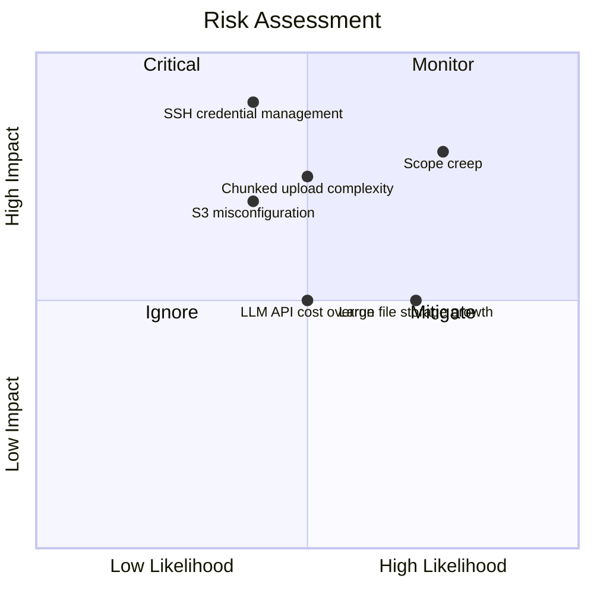

# 1. การวางแผน

- ที่มา: เป็นขั้นตอนแรกของ SDLC เกิดขึ้นก่อนการออกแบบหรือเขียนโค้ดใดๆ
- จุดประสงค์: ทำให้ทุกคนเข้าใจตรงกันว่าจะสร้างอะไร ทำไม และคุ้มค่าไหม
- ถ้าไม่มี: ทีมเริ่มสร้างโดยไม่มีข้อตกลงเรื่อง scope ทำให้เสียเวลา พลาด deadline และงานบานปลาย

---

## ขอบเขต

- ที่มา: มาจากการค้นหาปัญหาเบื้องต้น — แก้ปัญหาอะไร?
- จุดประสงค์: กำหนดขอบเขตชัดเจนว่า v1 มีและไม่มีอะไรบ้าง
- ถ้าไม่มี: ทุกไอเดียใหม่ถูกเพิ่มเข้ามา โปรเจกต์ไม่มีวันเสร็จ

สิ่งที่อยู่ใน v1:
- แพลตฟอร์ม self-hosted สำหรับจัดการเอกสารงานวิจัย (PDF, LaTeX, datasets, model weights)
- ถ่ายโอนไฟล์แบบ relay: old_server (SSH) → our_app → target_server (SSH หรือ S3/bucket)
- Chunked upload สำหรับไฟล์ขนาดใหญ่
- จัดการเอกสาร: จัดเก็บ จัดหมวดหมู่ tag ค้นหา
- Auto-tagging จากเนื้อหา PDF ด้วย LLM
- API-only

นอกขอบเขต v1:
- Frontend UI
- การทำงานร่วมกันหลายคน
- การแจ้งเตือนแบบ real-time

---

## ไทม์ไลน์

- ที่มา: มาจากขนาดของ scope และทรัพยากรที่มี
- จุดประสงค์: กำหนดความคาดหวังที่สมเหตุสมผลและสร้างจุดตรวจสอบความคืบหน้า
- ถ้าไม่มี: งานขยายออกไปเรื่อยๆ ไม่มีแรงกดดันให้ส่งมอบ

---

## ทรัพยากร

- ที่มา: รายการสิ่งที่มีอยู่เพื่อดำเนินการตามแผน
- จุดประสงค์: ระบุช่องว่างตั้งแต่เนิ่นๆ เพื่อรู้ปัญหาล่วงหน้า
- ถ้าไม่มี: พบกลางโปรเจกต์ว่าดำเนินการต่อไม่ได้เพราะขาด access หรืองบประมาณ

ที่มีอยู่:
- นักพัฒนา 1 คน
- OpenAI หรือ Gemini API key (สำหรับ auto-tagging)
- เซิร์ฟเวอร์หรือเครื่อง local ที่มี Docker

---

## การประเมินความเสี่ยง

- ที่มา: มาจากประสบการณ์และการถามว่า "อะไรอาจผิดพลาดได้?"
- จุดประสงค์: ระบุภัยคุกคามและกำหนดมาตรการป้องกันก่อนที่จะกลายเป็นปัญหา
- ถ้าไม่มี: ความเสี่ยงกลายเป็นเรื่องเซอร์ไพรส์ และเรื่องเซอร์ไพรส์ทำลายโปรเจกต์

| ความเสี่ยง | มาตรการป้องกัน |
|------------|----------------|
| ค่าใช้จ่าย LLM API เกิน | จำกัด token ต่อ request ใช้แค่ตัวอย่างข้อความ |
| พื้นที่เก็บไฟล์ขนาดใหญ่เพิ่มขึ้น | กำหนดขนาดไฟล์สูงสุด ติดตามการใช้ disk |
| ความซับซ้อนของ chunked upload | กำหนด protocol ชัดเจน เพิ่ม status endpoint |
| การจัดการ SSH credentials | เก็บ credentials แบบเข้ารหัส ห้ามเก็บ plaintext |
| S3/bucket misconfiguration | ตรวจสอบสิทธิ์การเข้าถึง bucket ตอน setup |
| งานบานปลาย | กำหนด OUT OF SCOPE ชัดเจนใน spec |

---

## การตัดสินใจ

- ที่มา: ผลลัพธ์ของขั้นตอนการวางแผนทั้งหมด
- จุดประสงค์: ระบุชัดเจนว่าจะดำเนินการต่อหรือไม่ ไม่มีความคลุมเครือ
- ถ้าไม่มี: งานเริ่มโดยไม่มีข้อตกลงอย่างเป็นทางการ ทำให้ละทิ้งหรือเปลี่ยนทิศทางได้ง่ายโดยไม่มีความรับผิดชอบ

ดำเนินการ v1 ตามที่กำหนดใน `specification.txt`
