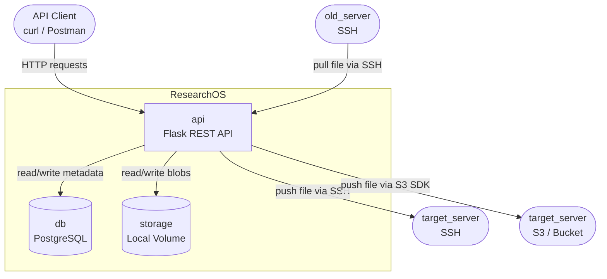
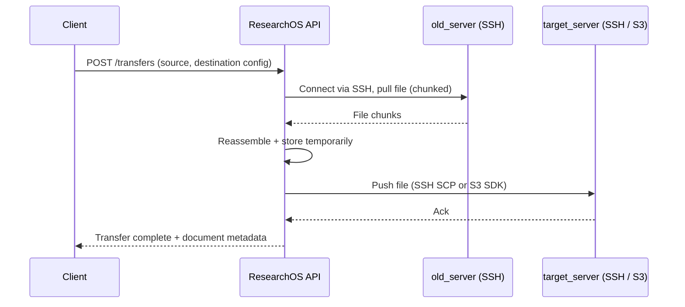

# 3a. สถาปัตยกรรมระบบ

- ที่มา: มาจาก requirements — ระบบต้องการส่วนประกอบกี่ส่วน?
- จุดประสงค์: กำหนดโครงสร้างระดับสูงของ services และการสื่อสารระหว่างกัน
- ถ้าไม่มี: นักพัฒนาตัดสินใจแยกกัน ทำให้เกิดความขัดแย้งตอน integrate

---

## ภาพรวมระบบ

---

## Flow การถ่ายโอนไฟล์

- ที่มา: requirement หลัก — old_server → our_app → target_server
- จุดประสงค์: แสดงให้เห็นว่า ResearchOS ทำหน้าที่เป็น relay ระหว่าง source และ destination
- ถ้าไม่มี: feature การถ่ายโอนไม่มีความชัดเจนว่าแต่ละขั้นตอนเป็นของใคร

---

## Services

- ที่มา: มาจากการตัดสินใจเรื่อง tech stack และ deployment requirements
- จุดประสงค์: กำหนดว่าแต่ละ container ทำอะไรและมีขอบเขตอย่างไร
- ถ้าไม่มี: ความรับผิดชอบทับซ้อนกัน services ผูกติดกันแน่นเกินไป

| Service | Image | หน้าที่ |
|---------|-------|---------|
| api | python:3.11 (custom) | Flask REST API, business logic, SSH/S3 transfer |
| db | postgres:15 | จัดเก็บ metadata แบบถาวร |
| storage | local volume | จัดเก็บ file blobs (temp chunks + final files) |
