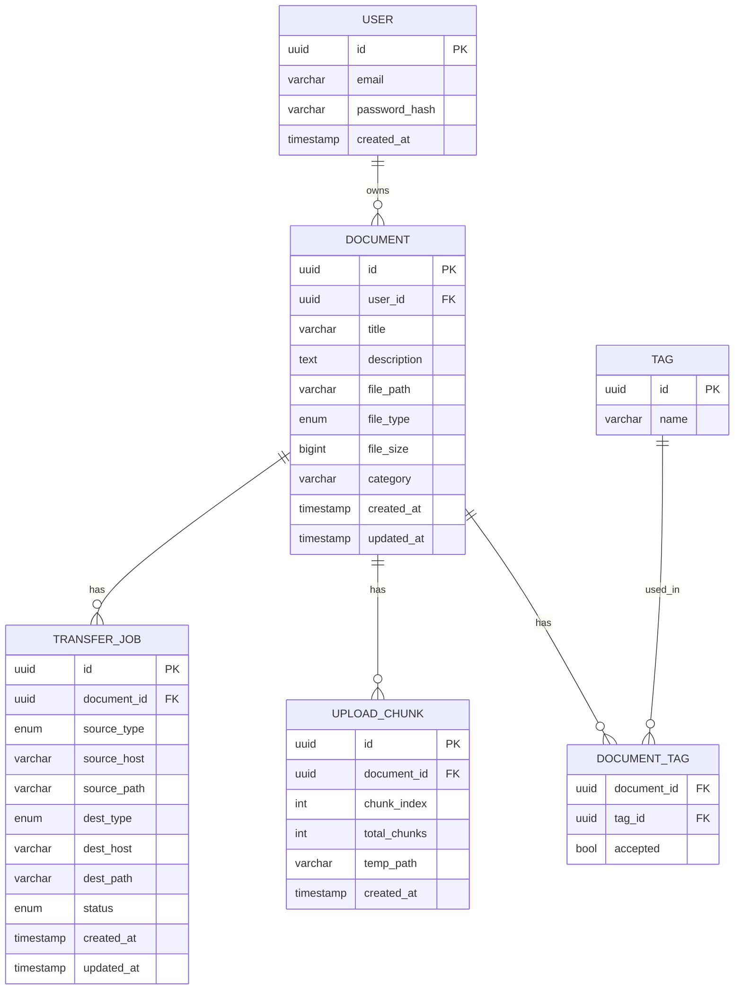

# 3b. Database Schema

- ที่มา: มาจาก data requirements ในขั้นตอนการวิเคราะห์ความต้องการ
- จุดประสงค์: กำหนดโครงสร้างของข้อมูลถาวรและความสัมพันธ์ระหว่าง entities
- ถ้าไม่มี: นักพัฒนาสร้าง table แบบ ad-hoc ทำให้ data model ไม่สอดคล้องกันและ migration วุ่นวาย

---

## Entity Relationship Diagram

---

## หมายเหตุ

- `file_type` enum: `pdf`, `latex`, `dataset`, `other`
- `source_type` / `dest_type` enum: `ssh`, `s3`, `local`
- `status` enum: `pending`, `in_progress`, `completed`, `failed`
- `DOCUMENT_TAG.accepted` ติดตามว่าผู้ใช้ยอมรับหรือปฏิเสธ tag ที่ LLM แนะนำ
- `UPLOAD_CHUNK` จะถูกลบหลังจาก reassembly เสร็จสมบูรณ์
