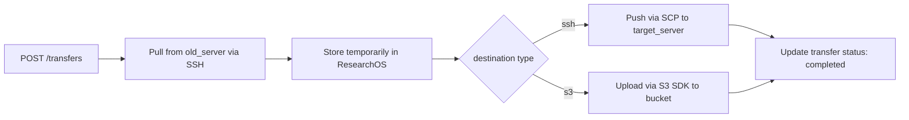

# 3c. API Contract

- ที่มา: มาจาก functional requirements — แต่ละ FR map ไปยัง endpoint หนึ่งหรือมากกว่า
- จุดประสงค์: กำหนด interface ระหว่าง client และ server ก่อนเริ่ม implement
- ถ้าไม่มี: client และ backend ตั้งสมมติฐานที่ไม่ตรงกันเรื่อง request/response

---

## Auth

| Method | Endpoint | คำอธิบาย |
|--------|----------|----------|
| POST | `/auth/register` | ลงทะเบียนผู้ใช้ใหม่ |
| POST | `/auth/login` | เข้าสู่ระบบ คืนค่า JWT token |

---

## Documents

| Method | Endpoint | คำอธิบาย |
|--------|----------|----------|
| GET | `/documents` | แสดงรายการเอกสาร (filter: tag, category, file_type) |
| POST | `/documents` | อัปโหลดไฟล์ + metadata |
| GET | `/documents/<id>` | ดู metadata ของเอกสาร |
| GET | `/documents/<id>/download` | ดาวน์โหลดไฟล์ |
| DELETE | `/documents/<id>` | ลบเอกสาร |
| GET | `/documents/<id>/status` | ตรวจสอบสถานะการอัปโหลด/ถ่ายโอน |

---

## Chunked Upload

| Method | Endpoint | คำอธิบาย |
|--------|----------|----------|
| POST | `/documents/<id>/chunks` | อัปโหลด chunk เดียว |

Request headers:
- `X-Chunk-Index`: หมายเลข chunk (เริ่มจาก 0)
- `X-Total-Chunks`: จำนวน chunk ทั้งหมด
- `Content-Type`: `application/octet-stream`

---

## Tags

| Method | Endpoint | คำอธิบาย |
|--------|----------|----------|
| GET | `/tags` | แสดง tags ทั้งหมด |
| POST | `/documents/<id>/tags` | เพิ่ม tags ด้วยตนเอง |

---

## LLM Auto-tag

| Method | Endpoint | คำอธิบาย |
|--------|----------|----------|
| POST | `/documents/<id>/autotag` | เรียกใช้ LLM เพื่อแนะนำ tags |
| PATCH | `/documents/<id>/tags/<tag_id>` | ยอมรับหรือปฏิเสธ tag ที่แนะนำ |

---

## File Transfer

| Method | Endpoint | คำอธิบาย |
|--------|----------|----------|
| POST | `/transfers` | สร้าง transfer job (old_server → our_app → target_server) |
| GET | `/transfers/<id>` | ตรวจสอบสถานะ transfer job |

### POST /transfers — Request Body

```json
{
  "document_id": "uuid",
  "source": {
    "type": "ssh",
    "host": "old_server_host",
    "port": 22,
    "username": "user",
    "key_path": "/path/to/key",
    "file_path": "/remote/path/file.pdf"
  },
  "destination": {
    "type": "ssh | s3",
    "host": "target_host",
    "port": 22,
    "username": "user",
    "key_path": "/path/to/key",
    "file_path": "/remote/path/file.pdf",
    "bucket": "my-bucket",
    "prefix": "research/"
  }
}
```

---

## Transfer Flow Diagram


