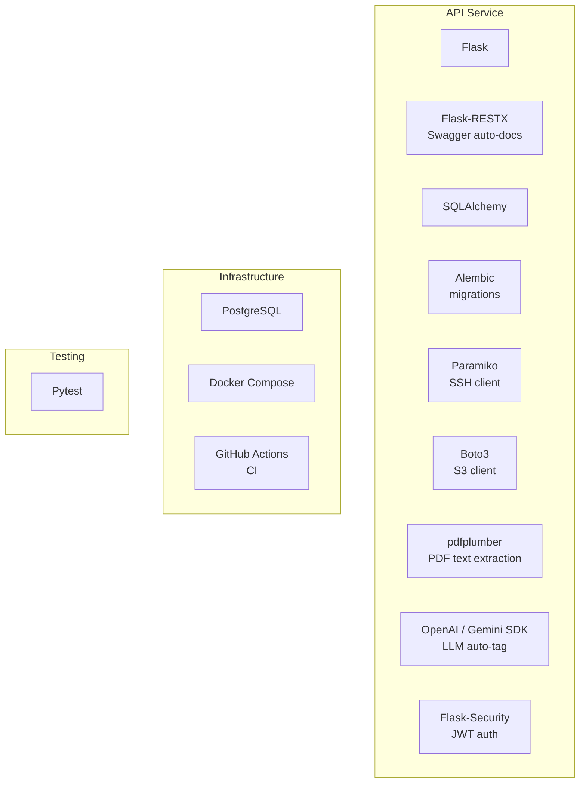

# 3d. Tech Stack

- ที่มา: การตัดสินใจโดยอิงจาก requirements ความคุ้นเคยของทีม และความสมบูรณ์ของ ecosystem
- จุดประสงค์: บันทึกว่าใช้เทคโนโลยีอะไรและทำไม เพื่อให้ผู้ร่วมพัฒนาในอนาคตเข้าใจเหตุผล
- ถ้าไม่มี: การเลือกเทคโนโลยีดูเหมือนสุ่ม และยากต่อการท้าทายหรือเปลี่ยนแปลง

---

## ภาพรวม Stack

---

## การตัดสินใจ

| Layer | ตัวเลือก | เหตุผล |
|-------|---------|--------|
| Web framework | Flask + Flask-RESTX | เบา, auto Swagger docs, เป็นที่รู้จักใน Python ecosystem |
| ORM | SQLAlchemy | สมบูรณ์, ยืดหยุ่น, ทำงานร่วมกับ Alembic ได้ดี |
| Database | PostgreSQL | เชื่อถือได้, รองรับ UUID, JSONB และ array types |
| Auth | Flask-Security (JWT) | integrate กับ Flask, จัดการ token lifecycle |
| SSH transfer | Paramiko | Pure Python SSH library ไม่ต้องพึ่ง system openssh |
| S3 transfer | Boto3 | AWS SDK มาตรฐาน ใช้กับ S3-compatible storage ได้ทุกตัว |
| PDF extraction | pdfplumber | API ง่าย, แม่นยำสำหรับ research PDFs |
| LLM | OpenAI / Gemini (configurable) | abstract ไว้ใน service layer เพื่อ swap ได้ |
| Containerization | Docker Compose | สั่งเดียว startup ตรงตาม spec requirement |
| CI | GitHub Actions | ฟรีสำหรับ public repo, integrate กับ GitHub โดยตรง |
| Testing | Pytest | testing framework มาตรฐานของ Python |
